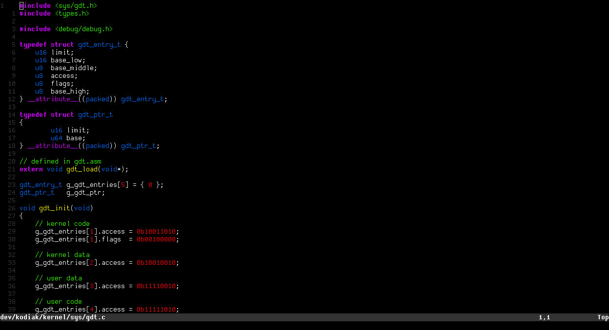

# hyper.nvim

A fork of [paulo-granthon's port](https://github.com/paulo-granthon/hyper.nvim) of the [Hyper.vim](https://github.com/jdsimcoe/hyper.vim) theme 



## Installation

### Using vim-plug

```lua
-- init.lua
Plug 'demoraescosta/hyper.nvim'
```

## License

This project is licensed under the [MIT License](https://github.com/demoraescosta/hyper.nvim/blob/main/LICENSE).
